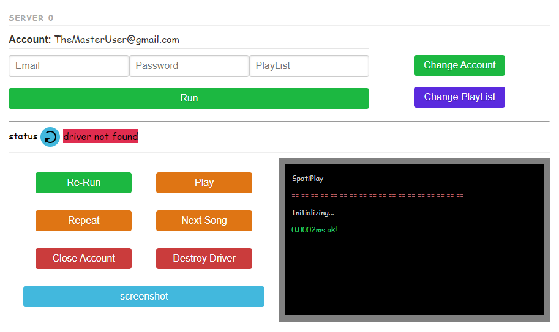
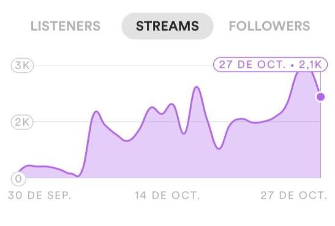
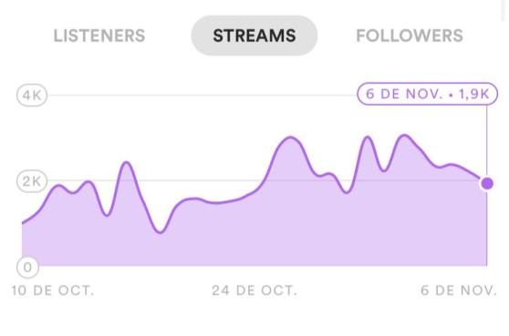

# Spotiplay
#### Viralize your music

__Spotiplay__ is a software which you can run your playlist in a loop on as many servers as you want,
Each instance is created on different servers so you don't have to worry about blocking problems.

## Benefits
___

* Manage your audience your way.
* Evade the spotify algorithm and get your audience to listen to the artists you want to be related to.
* More freedom, by being able to manage the accounts, you can set the guidelines of what to listen to and when.
* Monetise your audience.
* Increase your stats.
* Real time listeners.
* Consolidate your Artists.
* If you are an artist manager, spotiplay can help you to give them exposure.
* Goes from zero listeners to hundreds in a couple of clicks.

## How it works
___
We deploy a service for each account, in our service we have a graphic interface to make certain functionalities.
As a user you can interact with these features through each server panel and see their responses in real time on the console screen.

__These features will allow you to__:

* Login into your spotify accounts.
* Play a playlist as many times as you want.
* Login to free and premium accounts
* Change of songs
* Play or stop playlist
* Change playlist
* Close the account
* Setting the automatic repeat 
* see a screenshot in real time of what is happening

## Increase your stats
___
__Spotiplay__ takes care of increasing your play statistics and improving the reach and visibility of your playlists with the right audience.

|  |  |
|:---:|:---:|

## Getting Started
___
##### [Spotiplay web site!](https://dev-explosion.github.io/Spotiplay/admin)

#### What to do to connect

To connect you must buy a __Connection String__

#### Que es un Connection String

Is a string which allows to establish the connection to the different servers acquired by the user.

[__Contact us at Telegram to know more__ and ask for our test (connectionString)]((https://dev-explosion.github.io/Spotiplay/admin))

### ¡WARNINGS!
___

* __Spotiplay does not create spotify accounts__.

* __Spotify__ is kept constantly updated because of this some options may be disabled over time we will keep this repo 
updated and we will report any mishaps we may encounter along the way.

___
## We only accept Bitcoin Payments
___

## Liscence 

#### MIT

